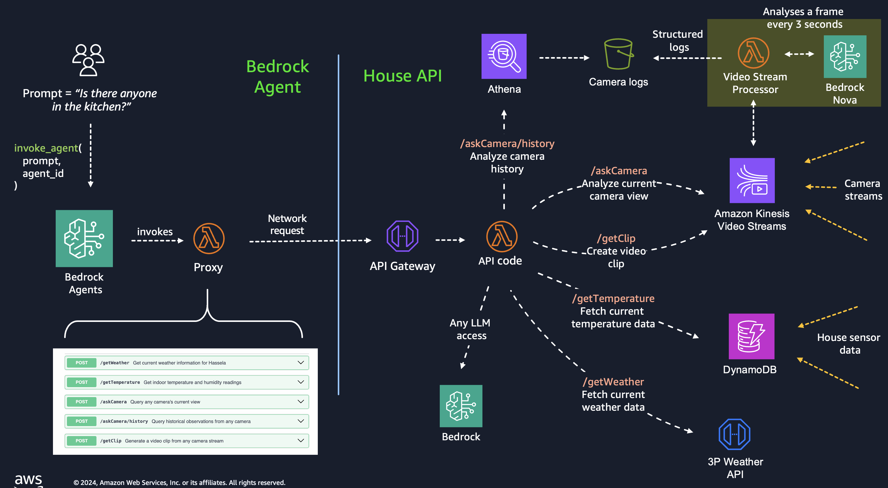
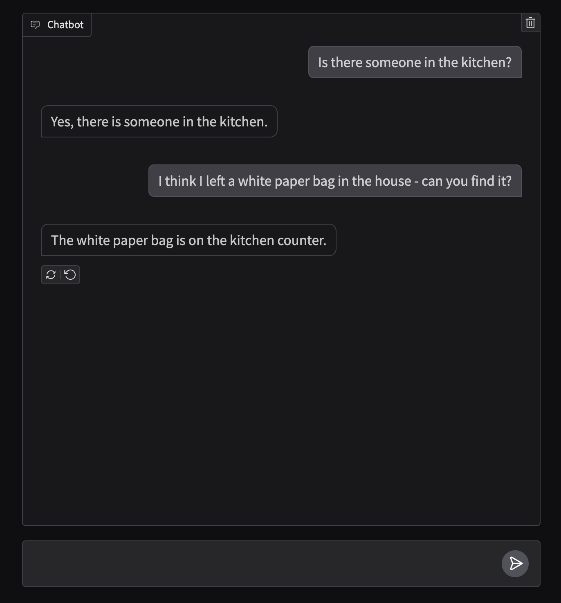

## Connected House Agent

### Overview

This sample sets up a Bedrock Agent that can interact with data from real-time cameras and temperature sensor, to enable asking questions about what's happening in the house, when someone was last in a room and what they did as well as questions about the outside inside temperature.



The sample consists of three separate entities or "services".

If you want learn abou how to connect your own cameras to Kinesis, the [developer guide](https://docs.aws.amazon.com/kinesisvideostreams/latest/dg/gs-send-data.html) has some good examples. If you want to connect your own temperature sensors, you can use AWS IoT Core with your own microprocessors (instructions [here](https://docs.aws.amazon.com/iot/latest/developerguide/iot-ddb-rule.html)) or use any of the AWS SDKs to write data to DynamoDB.

#### House API

The API for the house. This is an IAM authenticated API that the agent can query depending on what information it wants.

#### House Agent

The Bedrock agent alogn with instructions and configuration, detailing how it can interact with the House API. Since the agent interacts with an existing API, it uses a Lambda function to parse, sign and send requests to the House API.

#### Camera Stream Processor

A stream processor that continuously analyses all kinesis video streams and generates a log to simplify access to historical data. By using shorter logs for querying historical data, we limit the amount of tokens historical queries consumes drastically. The House API has access to the generated logs, which are used for responding to historical queries on what a camera has observed within a specified time frame.

> [!NOTE]  
> Although it limits the flexibility of historical queries slightly, it's a reasonable trade-off for this use case. Since we know the setting in which the cameras are used (home surveillance) we can formulate the prompt that generates the logs so that it contains information related to home surveillance (movement, changes etc).

### Pre-requisites

- [AWS CLI](https://docs.aws.amazon.com/cli/latest/userguide/getting-started-install.html) and AWS [SAM CLI](https://docs.aws.amazon.com/serverless-application-model/latest/developerguide/install-sam-cli.html) installed
- Openweathermap API key (if you want outside weather conditions)
- python 3.11
- Docker & Docker compose (for simulating cameras and sensors)

### Installation

0. Install local dependencies

```bash
pip install -r requirements.txt
```

1. Configure secrets

The sample uses the [OpenWeatherMap API](https://openweathermap.org/) to fetch outside weather information. The secret is injected into the Lambda environment using a [dynamic reference](https://docs.aws.amazon.com/AWSCloudFormation/latest/UserGuide/dynamic-references-secretsmanager.html) in the cloudformation template, to fetch the secret during deployment.
You can update the secret name used in the cloudformation, or create a secret that matches the naming scheme already used. To create a secret matching the existing scheme using the AWS CLI, run

```bash
aws secretsmanager create-secret --name dev/openweather/api --secret-string '{"apikey": "INSERT YOUR KEY HERE"}'
```

To use sample weather (i.e not using the openweather map API), create a secret as above with "test" as the api key:

```bash
aws secretsmanager create-secret --name dev/openweather/api --secret-string '{"apikey": "test"}'
```

2. Verify local hardware architecture

By default the container is built on Mac silicone, so if you're building the container on a different architecture, update the platform in the `dockerfile.sensor`, `dockerfile.streamer` and `docker-compose.yml`

3. Deploy Agent

```bash
make go
```

This builds and deploys the agent

4. Simulate data

```bash
make start-sim
```

This builds and starts 2 containers, one for simulating real-time cameras, and one for temperature sensors.

> [!NOTE]  
> The camera simulation camera container may take several minutes to download and install all dependencies

5. Test agent.

You can test the agent either through the Bedrock Agents UI in the AWS Console, create a lightweight UI, or use the AWS API directly.

To use the API driectly, run:

```bash
make invoke query="Whats the house status?"
```

You can update the query to whatever you wish.

```bash
make invoke query="I left a white paper bag in the house - can you find it?"
```

To create a chat interface running locally, run

```bash
make start-frontend
```

This launches a frontend accesible on [http://localhost:7861](http://localhost:7861)



> [!NOTE]  
> You can also ask historical questions, like "When was the last time someone was in the livingroom?". The agent will then iteratively use the historical endpoint, continuously expanding the timeframe until it finds a log when someone was there. Note that these types of queries requires the data simulation to have run a while, generating data.

### Deletion

1. Stop simulating data

```bash
make stop-sim
```

2. delete stack

```bash
make delete
```

> [!NOTE]  
> While all data in S3 is automatically deleted after a while (specified in the cloudformation template per bucket), deleting the cloudformation stack may fail if the objects in the S3 buckets haven't been deleted yet. Either wait a day, or manually delete them
