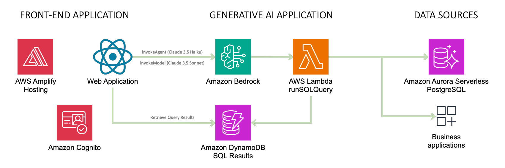
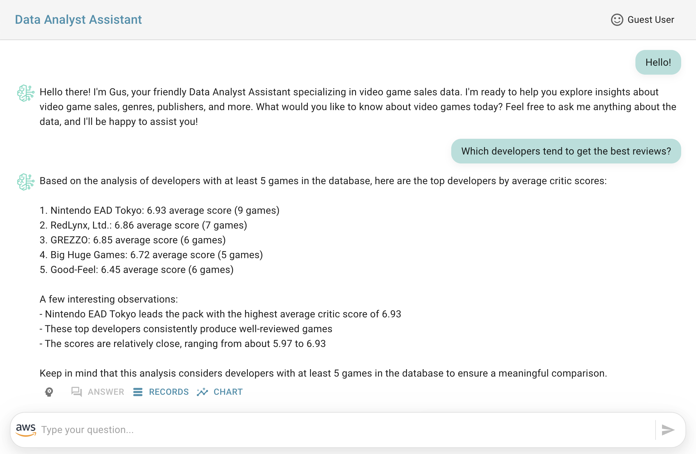
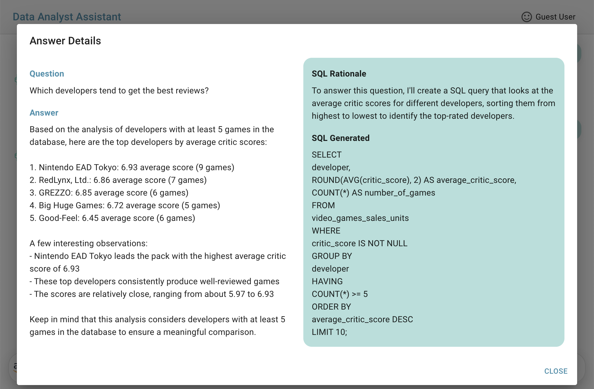
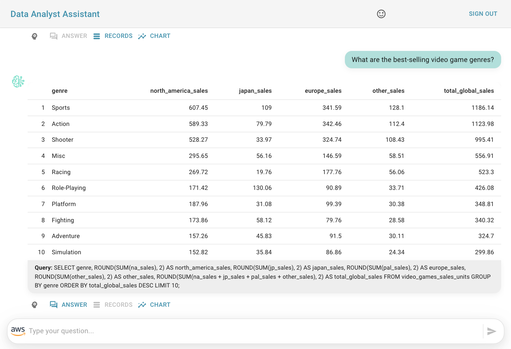

# Tutorial to Deploy the Data Analyst Assistant for Video Game Sales Using Amazon Bedrock Agents

This solution provides a Generative AI Application reference that is able to access structured data stored in a PostgreSQL database based on a question-answering assistant that generates SQL queries to obtain the necessary data to provide an answer in natural language. **Also, you can change the data source to connect to your preferred database engine by adapting the Agent's instructions and the Lambda function logic.**

**To deploy the application, please follow these instructions:**

> *It is recommended to use the Oregon (us-west-2) or N. Virginia (us-east-1) regions to deploy the application.*

1. [Getting Started with SAM Video Games Sales Assistant and Amazon Bedrock Agents](./sam-bedrock-video-games-sales-assistant/)
2. [Getting Started with Amplify Video Games Sales Assistant](./amplify-video-games-sales-assistant-sample/)

## AWS Diagram Architecture

## Application Preview

The following images are part of a conversation analysis that includes the natural language answer, the rationale used by the LLM to generate the SQL query, the records resulting from the SQL query used to answer the question, and chart generation.

**Agent answers**

**Answer details including the rationale to generate the SQL**

**The record results from the SQL used to answer the question**

**The chart generated using the agent's answer and the record results from the SQL Query (charts created using [Apexcharts](https://apexcharts.com/))**

