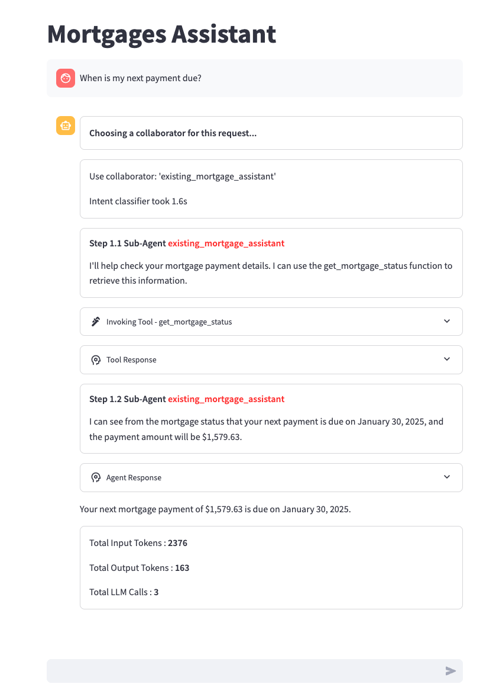

# Streamlit Demo UI

A Streamlit-based user interface that can be used with any text-based Bedrock agent by updating the `config.py` file.

## Using with Any Bedrock Agent

To add your own agent:

1. Add a new configuration to the `bot_configs` list in `config.py`:
```python
{
    "bot_name": "Your Bot Name",  # Display name in the UI
    "agent_name": "your_agent_id", # Your Bedrock agent ID
    "start_prompt": "Initial message to show users",
    "session_attributes": {        # Optional: Include if your agent needs specific session attributes
        "sessionAttributes": {      # Custom key-value pairs for your agent's session
            "key1": "value1",
            "key2": "value2"
        },
        "promptSessionAttributes": {} # Additional prompt-specific attributes if needed
    }
}
```

## Tested Demo Examples

The following demos have been tested with this UI and can be found in their respective folders:


- **Sports Team Poet** (`/examples/multi_agent_collaboration/team_poems_agent/`): Creates poems about sports teams
- **Portfolio Assistant** (`/examples/multi_agent_collaboration/portfolio_assistant_agent/`): Analyzes stock tickers
- **Trip Planner** (`/examples/multi_agent_collaboration/trip_planner_agent/`): Generates travel itineraries
- **Voyage Virtuoso** (`/examples/multi_agent_collaboration/voyage_virtuoso_agent/`): Provides exotic travel recommendations
- **Mortgages Assistant** (`/examples/multi_agent_collaboration/mortgage_assistant/`): Handles mortgage-related queries
- **Custom Orchestration** (`/examples/agents/custom_orchestration_agent/`): Demonstrates ReWoo (Reasoning without Observation) orchestration for a restaurant assistant agent

## Prerequisites

1. Follow the setup instructions in each agent's respective folder before using them in the demo UI:
   - `/examples/multi_agent_collaboration/mortgage_assistant/README.md`
   - `/examples/multi_agent_collaboration/voyage_virtuoso_agent/README.md`
   - `/examples/multi_agent_collaboration/trip_planner_agent/README.md`
   - `/examples/multi_agent_collaboration/team_poems_agent/README.md`
   - `/examples/agents/custom_orchestration_agent/README.md`
   - `/examples/multi_agent_collaboration/portfolio_assistant_agent/README.md`

2. Ensure you have:
   - Python 3.x
   - AWS credentials configured with appropriate permissions

3. Create and activate a Python virtual environment:
   ```bash
   python3 -m venv .venv
   source .venv/bin/activate  
   ```

4. Install required dependencies:
   ```bash
   pip install -r src/requirements.txt
   ```

## Running the Demo

3. Configure your AWS credentials with appropriate permissions

4. Run the Streamlit application:
   ```bash
   cd examples/agents_ux/streamlit_demo/; streamlit run demo_ui.py
   ```

5. Optionally, specify a specific bot using the BOT_NAME environment variable:
   ```bash
   BOT_NAME="<bot-name>" streamlit run demo_ui.py
   ```

   Supported BOT_NAME values:
   - "Portfolio Assistant" 
   - "Sports Team Poet"
   - "Trip Planner"
   - "Voyage Virtuoso"
   - "Mortgages Assistant" (default)
   - "Custom Orchestration"

## Usage

1. The UI will display the selected bot's interface (defaults to Mortgages Assistant if not specified)
2. Enter your query in the chat input field
3. The agent will:
   - Process your request
   - Show the collaboration between different agents
   - Display thought processes and tool usage
   - Provide a detailed response

## Architecture

The demo UI integrates with Amazon Bedrock Agent Runtime for agent execution and showcases multi_agent_collaboration features including:

- Dynamic routing between specialized agents
- Knowledge base lookups
- Tool invocations
- Code interpretation capabilities

Below is an example of the demo UI in action, showing the Mortgages Assistant interface:


