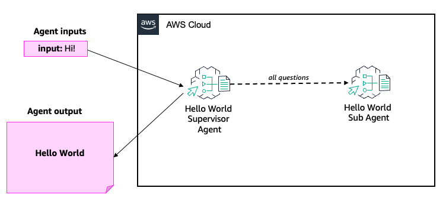

# Hello World Agent

This example is a great way to get started!

## Architecture Diagram



## Prerequisites

```bash
git clone https://github.com/awslabs/amazon-bedrock-agent-samples

cd amazon-bedrock-agent-samples

python3 -m venv .venv

source .venv/bin/activate

pip3 install -r src/requirements.txt
```

## Usage & Sample Prompts

1. Deploy Amazon Bedrock Agents

```bash
python3 examples/multi_agent_collaboration/00_hello_world_agent/main.py --recreate_agents "true"
```

2. Invoke

```bash
python3 examples/multi_agent_collaboration/00_hello_world_agent/main.py --recreate_agents "false"
```

3. Cleanup

```bash
python3 examples/multi_agent_collaboration/00_hello_world_agent/main.py --clean_up "true"
```

## License

This project is licensed under the Apache-2.0 License.