# Setup Overview

To Run this demo you will need to provide 2 secrets to the file `devops.properties.template` and rename the file `devops.properties`
1. A GitHub Personal Access Token such that you can read issues and PRs from public repositories
2. A Grafana Service Account Token with view permissions

This README contains a reference for GitHub personal access tokens, reference for how to get a service account token for an existing Grafana instance.
In the event you do not have a Grafana instance but would like to run this demo please follow steps **Creating a Amazon Managed Grafana Workspace to Run this Demo**

## GitHub - Personal Access Token

Please refer to the GitHub Documentation on [Creating Personal Access Tokens](https://docs.github.com/en/authentication/keeping-your-account-and-data-secure/managing-your-personal-access-tokens#creating-a-personal-access-token-classic). `(no scope)` access level is sufficient, as this lightweight demo only reads pull requests on this public repository. 
update the value at `examples/multi-agent-collaboration/devops_agent/devops.properties` (rename the file from cloned repo `devops.properties.template`)

## Existing Grafana
This demo assumes that you have an existing Grafana Instance with alarms configured.
--> If you have this please create a [Service Account Token](https://grafana.com/docs/grafana/latest/administration/service-accounts/#add-a-token-to-a-service-account-in-grafana) with `viewer` permissions and update the value at `examples/multi-agent-collaboration/devops_agent/devops.properties` (rename the file from cloned repo `devops.properties.template`)

Note that the action group AWS Lambda Function will assume your Grafana rules exist in the folder `devops-agent-demo`. Please create some example rules, alerts and alarms in this folder.

> In the event you do not have existing Grafana Dashboard accessible over the public internet and ability to authenticate with a Service Account Token follow these steps to setup an example application:

# Creating a Amazon Managed Grafana Workspace to Run this Demo

[Amazon Managed Grafana](https://aws.amazon.com/grafana/)  provides fully managed data visualization and analytics without the operational overhead of hosting and maintaining Grafana servers yourself. It seamlessly integrates with AWS services and allows you to securely monitor metrics, logs, and traces across your applications at scale.

This will setup process will have 2 main steps:
1) Trivial Metrics Producing Application Setup (CDK)
2) Manual Grafana Alerts Configuration 

## IAM Identity Center (KEY-PREREQUISITE)
[Amazon Managed Grafana: User Authentication](https://docs.aws.amazon.com/grafana/latest/userguide/authentication-in-AMG.html) has two authentication methods:
1) [SAML](https://docs.aws.amazon.com/grafana/latest/userguide/authentication-in-AMG-SAML.html)
2) [IAM Identity Center](https://docs.aws.amazon.com/grafana/latest/userguide/authentication-in-AMG-SSO.html)

**This guide will only support IAM Identity Center Authentication to Amazon Managed Grafana**

It is recommended to configure:
1) A sandbox account within your AWS Organization Setup to run this demo.
2) A User in IAM Identity Center with `AdministratorAccess` to the Sandbox Account

*To learn more about Sandbox Accounts consider these resources*: 
- [Sandbox OU - AWS Whitepapers](https://docs.aws.amazon.com/whitepapers/latest/organizing-your-aws-environment/sandbox-ou.html)
- [Best practices for creating and managing sandbox accounts in AWS](https://aws.amazon.com/blogs/mt/best-practices-creating-managing-sandbox-accounts-aws/)
- [Provision sandbox accounts with budget limits to reduce costs using AWS Control Tower](https://aws.amazon.com/blogs/mt/provision-sandbox-accounts-with-budget-limits-to-reduce-costs-using-aws-control-tower/)

*How to create a new AWS Account in Organizations?*
1) [Create a Member Account](https://docs.aws.amazon.com/organizations/latest/userguide/orgs_manage_accounts_create.html)


*How to create users in IAM Identity Center Docs to:*
1) [Create new user](https://docs.aws.amazon.com/singlesignon/latest/userguide/addusers.html)
2) [Assign user to AWS Account](https://docs.aws.amazon.com/singlesignon/latest/userguide/assignusers.html)
    - Assign the user `AdministratorAccess` from [predefined permission](https://docs.aws.amazon.com/singlesignon/latest/userguide/permissionsetpredefined.html)

You will use this user credentials to 
1) Deploy the `cdk-app`
2) Access the AWS Console for manual configuration of grafana Workspace
3) Authenticate to the grafana Workspace Instance as an Administrator

### 1) Trivial Metrics Producing Application Setup

The Setup Instructions Reply on [AWS Cloud Development Kit](https://aws.amazon.com/cdk/) to create:
1) An AWS Lambda Function that produces synthetic CloudWatch Telemetry Data
2) Create an Amazon Managed grafana Instance

###### Install Cloud Development Kit:
> Skip this section if you already have AWS CDK Configured Locally.
Check if you have AWS CDK installed locally with `cdk --version`

Following CDK Developer Guide [Prerequisites](https://docs.aws.amazon.com/cdk/v2/guide/prerequisites.html) & [Getting started](https://docs.aws.amazon.com/cdk/v2/guide/getting_started.html) 
```bash
# Requirement for TypeScript 3.8 or later
npm -g install typescript

# Install CDK
npm install -g aws-cdk

# Validate in the Sandbox account
aws sts get-caller-identity --query "Account" --output text
# Make note of your default account - 
aws configure get region

cdk bootstrap # Create the CDK bootstrap stack in the default account
```

#### Deploy Stacks
```bash
# Enter the Directory of the Example Application
cd amazon-bedrock-agent-samples./cdk-app

cdk synth
cdk deploy SyntheticTelemetryApplicationStack
cdk deploy AmazonManagedGrafanaStack
```

In the AWS Console Navigate to the CloudFormation Console to confirm all thats deployed correctly:
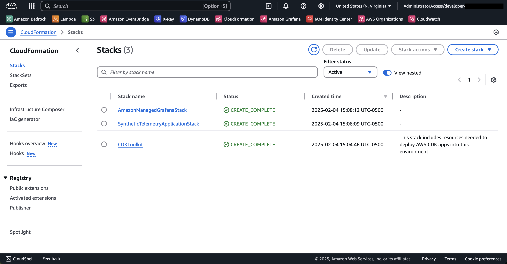

#### Configure Amazon Grafana Workspace
1) Open the Amazon Grafana console
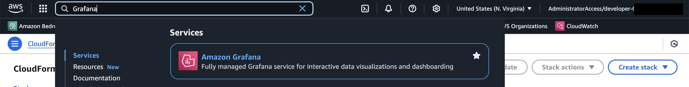

2) Click on and enter the workspace `devops-agent-workspace`
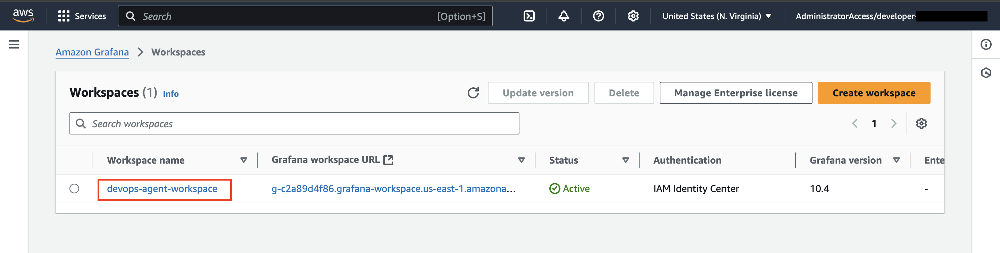

3) Click **Assign new user or group** button
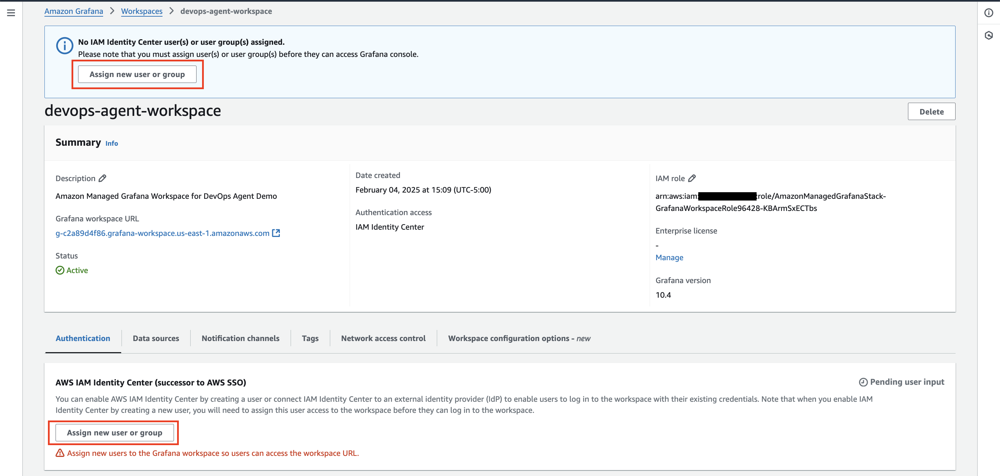

Please complete this Wizard by selected the IAM Identity Center User you pre-configured above in "IAM Identity Center (KEY-PREREQUISITE)"

4) Assign the New User Admin Access
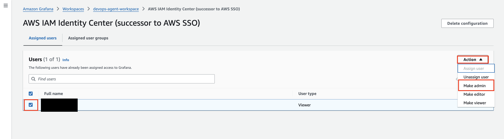


5) Return to the `devops-agent-workspace` and enter the **Workspace configuration options** tab
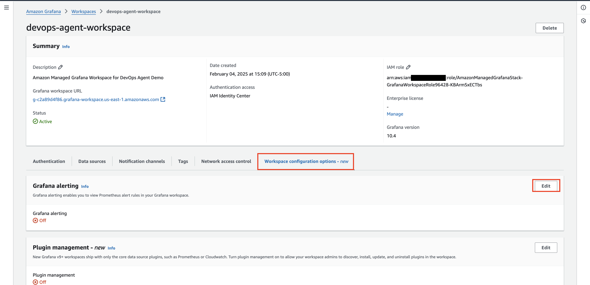

6) Click the **Edit** Button. Enable "Turn Grafana alerting on" then **Save Changes** button
- Wait for the Status of your workspace to change from updating to available
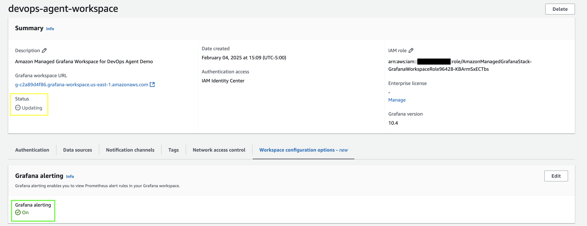

#### Configure Grafana <--> CloudWatch Connection
1) Open your Grafana Workspace URL: `g-XXXXXXXXXX.grafana-workspace.<region>.amazonaws.com`
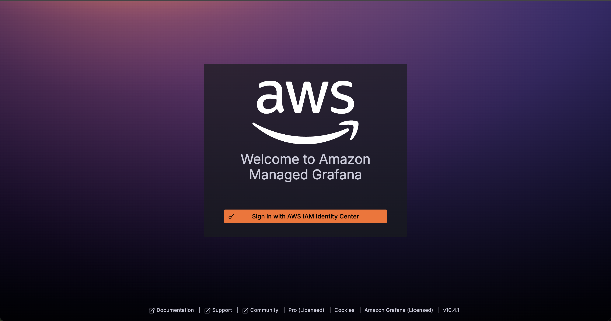
When you click the **Sign in with AWS IAM Identity Center** Button

*If you have an IAM Identity Center User Browser Session Active* then you will be redirected to the landing page

*Otherwise you will be redirected to a login page* 
- Provide the IAM Identity Center User credentials that we authorized for this Managed Grafana Instance. 
- On the Access Portal Page - Toggle to Applications to enter the Grafana Landing Page


2) From Grafana Landing page Navigate to `Connections` --> `Data sources` | Add CloudWatch
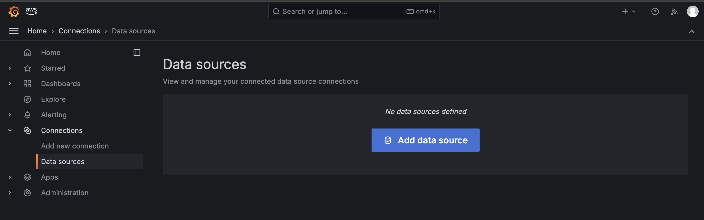

Click **Add data source** button
Then Search for and click on CloudWatch
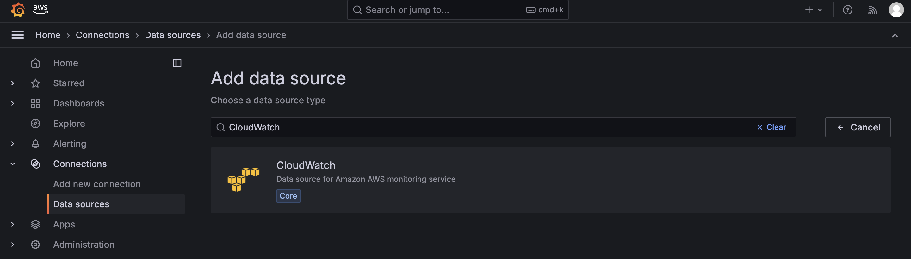

3) Complete the CloudWatch Connection Details 

a) This requires an IAM role that was created in the `AmazonManagedGrafanaStack`. Copy past the IAM Role ARN
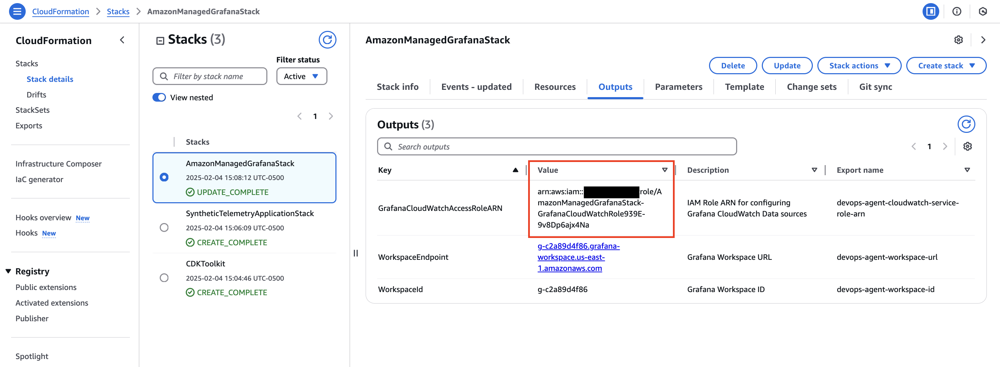

b) fill in the details of the Grafana Managed Access Page:
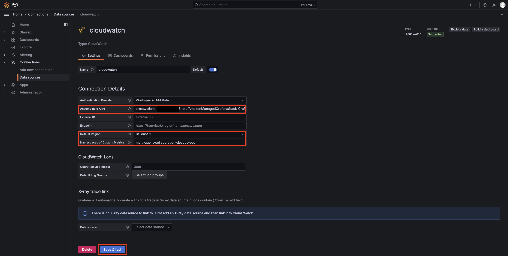
- Copy and paste the IAM Role from (a) above
- Fill in your default AWS region. Meaning where the Cloudformation Stacks from `cdk-app` are deployed into
- For the field *Namespaces of Custom Metrics* please input: `multi-agent-collaboration-devops-poc` this is hardcoded into the lambda function that generates synthetic telemetry metrics
- Hit **Save & test** button

### 2) Manual Grafana Alerts Configuration 

#### Configure Alerting Rules

Now we will configure 3 Alerting Rules:
1) `ResponseTime` - Which will very likely be **Firing**
2) `CPU Utilization` - Which will very likely be **Healthy**
3) `Memory Utilization` - Which will alternates between **Firing** and **Healthy**

Navigate the the Alerting Rules Page:
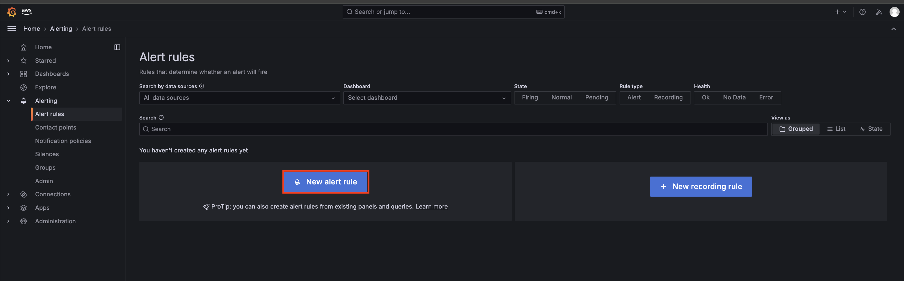

##### Altering Rule 1 Configuration

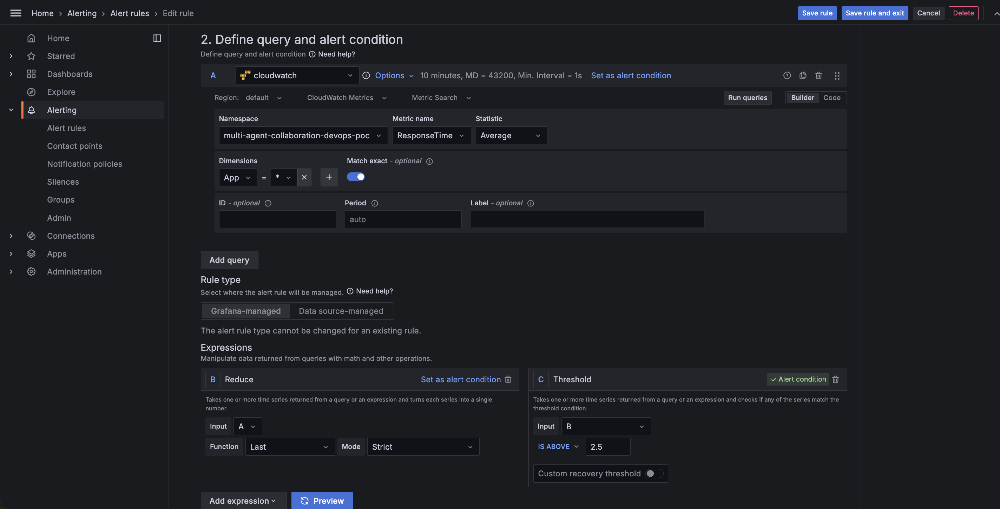


_1. Enter alert rule name_
- Name: `ResponseTime`

_2. Define query and alert condition_
A `cloudwatch`
- namespace: `multi-agent-collaboration-devops-poc`
- Metric name: `ResponseTime`
- Statistic: Average
- **Dimensions**
    - `App` = `*`

B Reduce (leave defaults)
- Input A
- Function: Last
- Mode: Strict

C Threshold
- Input: B
- IS ABOVE: **2.5**

_3. Set evaluation behavior_
- Create a new folder called `devops-agent-demo`
- create a new evaluation group `demo-evaluation-group`
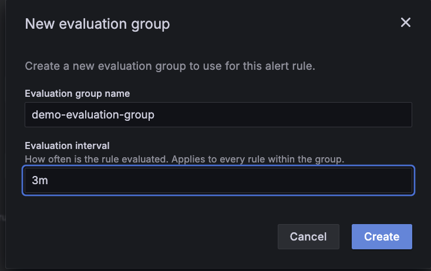

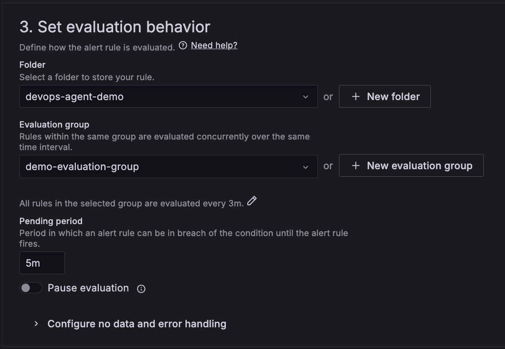

_4. Configure labels and notifications_
Select contact point as grafana-default-sns
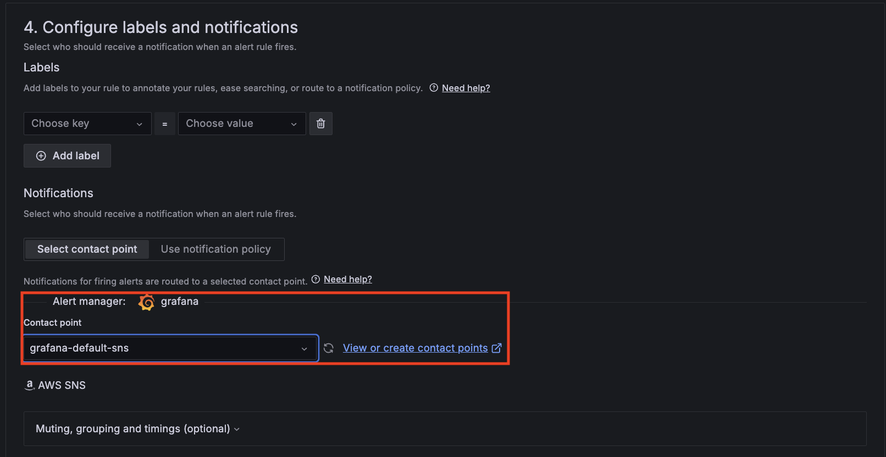

Ignore _5. Add annotations_

Hit the **Save rule** or **Save rule and exit** button in the top right

##### Altering Rule 2 Configuration
Navigate Back to Alert rules then click create new rule
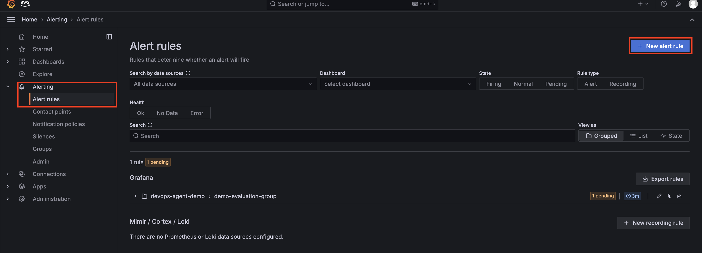

_1. Enter alert rule name_
- Name: `CPU Utilization`

_2. Define query and alert condition_
A `cloudwatch`
- namespace: `multi-agent-collaboration-devops-poc`
- Metric name: `CPU`
- Statistic: Average
- **Dimensions**
    - `App` = `*`

B Reduce (leave defaults)
- Input A
- Function: Last
- Mode: Strict

C Threshold
- Input: B
- IS ABOVE: **80**

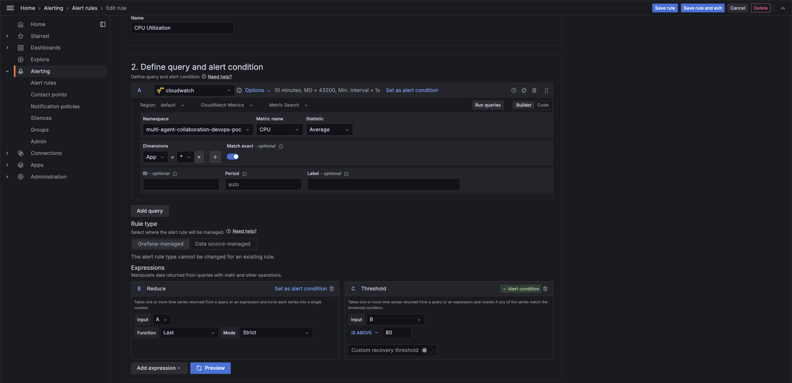

_3. Set evaluation behavior_
Select existing folder `devops-agent-demo`

Select existing evaluation group `demo-evaluation-group`


_4. Configure labels and notifications_
Select contact point as grafana-default-sns


Ignore _5. Add annotations_

Hit the **Save rule** or **Save rule and exit** button in the top right

##### Alerting Rule 3 Configuration
_1. Enter alert rule name_
- Name: `Memory Utilization`

_2. Define query and alert condition_
A `cloudwatch`
- namespace: `multi-agent-collaboration-devops-poc`
- Metric name: `MEM`
- Statistic: Average
- **Dimensions**
    - `App` = `*`

B Reduce (leave defaults)
- Input A
- Function: Last
- Mode: Strict

C Threshold
- Input: B
- IS ABOVE: **70**

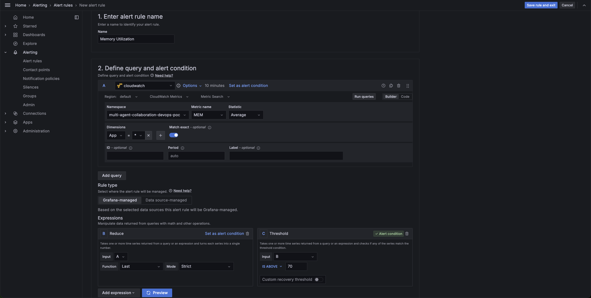

_3. Set evaluation behavior_
Select existing folder `devops-agent-demo`

Select existing evaluation group `demo-evaluation-group`


_4. Configure labels and notifications_
Select contact point as grafana-default-sns


Ignore _5. Add annotations_

### Grafana API Secret 
To Create a secret token for the file `examples/multi-agent-collaboration/devops_agent/devops.properties.template` follow these steps:

1) Navigate to the Service Accounts page `Administration` --> `Users and access` --> `Service accounts`
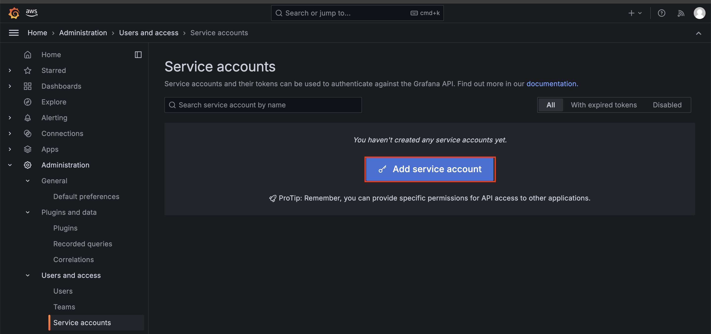

Click the button for the form:
Display Name: `multi-agent-dev-ops-demo`
Role: Viewer

Create creates the service account:
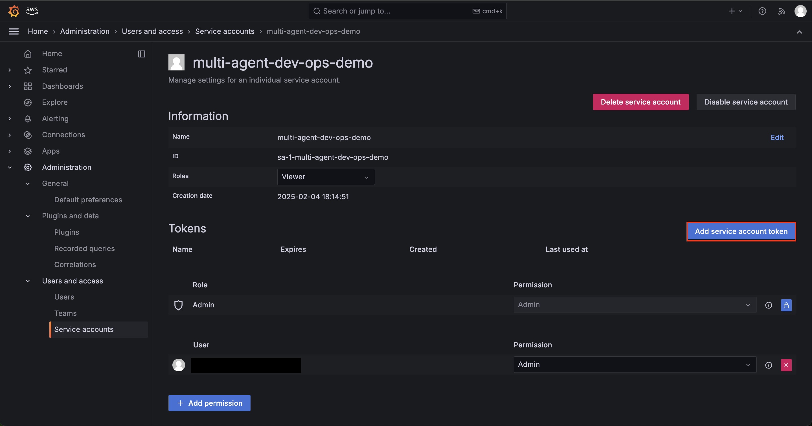

When you click the button it will ask you for:
1) a token name. Select anything like `demo-token-1`
2) an expiration date.


Save this Token! once you close this window the token will disappear forever.
Remember to save it to `devops.properties.template` before continuing to step 1!


# Cleanup

After completing the labs you can destroy these setup resources with:

```bash
cdk destroy SyntheticTelemetryApplicationStack
cdk destroy AmazonManagedGrafanaStack
```