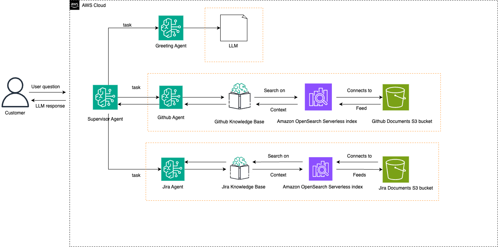

# Support Assistant Agent

This example demonstrates the use of Amazon Bedrock Agents multi-agent collaboration with its built-in Routing Classifier feature. By simply enabling that mode for your supervisor, Bedrock automatically routes to the correct collaborating sub-agent using LLM intent classification optimized to route with sub-second latency. Contrast that with a traditional supervisor that must go through its own orchestration loop, a more expensive proposition that can take 3-6 seconds depending on which LLM you are using. This feature is most valuable when trying to build a unified customer experience across a set of sub-agents. In our example, we have 3 collaborators: one for general mortgage questions, one for handling conversations about Existing mortgages, and another for dealing with New mortgages.

Try sample prompts:

- "What are the current JIRA tasks?"
- "How to create a github API token?"

Each of these gets routed quickly to the right sub-agent for subsequent processing.
Conversation switching is seamless.

## Architecture



## Prerequisites

1. Clone and install repository

```bash
git clone https://github.com/awslabs/amazon-bedrock-agent-samples

cd amazon-bedrock-agent-samples

python3 -m venv .venv

source .venv/bin/activate

pip3 install -r src/requirements.txt
```

## Usage & Sample Prompts

1. Deploy Amazon Bedrock Agents

```bash
cd examples/multi_agent_collaboration/mortgage_assistant/
python3 main.py --recreate_agents "true" --confluence_url "<your confluence url>" --username "<your confluence username>" --token "<your confluence API access token>"
```
To add a greeting agent for handling users greeting, you can use the below command:
```bash
cd examples/multi_agent_collaboration/mortgage_assistant/
python3 main.py --recreate_agents "true" --agent_greeting "true" --confluence_url "<your confluence url>" --username "<your confluence username>" --token "<your confluence API access token>"
```

2. Invoke

```bash
python3 main.py --recreate_agents "false"
```

3. Cleanup

```bash
python3 main.py --clean_up "true"
```

## License

This project is licensed under the Apache-2.0 License.